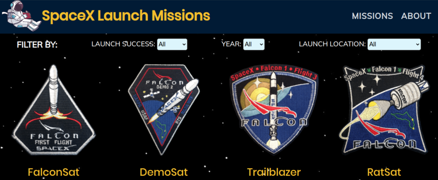
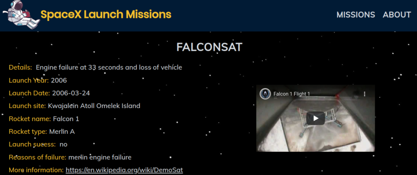

## React-Redux Project: Build a Catalog

 
  <h1 color= "rgb(243, 190, 44)" font-size= "40"> SpaceX Launch Missions </h1>

## Table of Contents

* [About the Project](#about-the-project)
* [The Catalog](#the-catalog)
  * [Installation](#installation)
* [Video Presentation](#video-presentation)
* [Technologies used](#technologies-used)
* [Author](#author)
* [Show your Support](#show-your-support)
* [Acknowledgments](#acknowledgments)

<!-- ABOUT THE PROJECT -->
## About The Project

The object of this project was to build with React and Redux, a catalog that contains a browsable list of items, these can be filtered and also, can access the details of each one of them.

Live version of the project: [Live version](https://react-redux-spacex.herokuapp.com/)

Project Link: [React-Redux-Capstone](https://github.com/mcastorena0316/react-redux-capstone)

<!-- THE GAME -->
## The Catalog

This catalog includes information about the launches executed by the company SpaceX. On the main page, you can see all the launches released until this day, and you can filter them by year, location of the launch, and if it was successful or not.

If you want to know more details about each one of them, you can click on the image, and you can see important information about the launch that includes: 

* Detail of the mission
* Launch Date, Year, and Place
* Rocket type and name
* Status of success
* Reasons for failure (if applicable)
* Wikipedia article describing the details of the mission
* Youtube video about the launching

<!-- INSTALLATION -->
### Installation

You can always use the [live version](https://react-redux-spacex.herokuapp.com/) or install it locally using these steps:

#### Clone my repository

`$ git clone https://github.com/mcastorena0316/react-redux-capstone`

#### Go to my project's folder

`$ cd react-redux-capstone`

#### Get the dependencies needed

`$ npm install`

#### Open the project
`$ npm run start`

<!-- VIDEO PRESENTATION -->
## Video Presentation
[Link to Video Presentation](https://youtu.be/p5QySQZuzq4)

<!-- TECHNOLOGIES USED -->
## Technologies used
* Javascript
* CSS
* React
* Redux
* Heroku
* Jest & Enzyme
* [Space X API](https://api.spacexdata.com/)

<!--AUTHOR -->
## Author
<table style="width:100%">
  <tr>
    <td>
      

        
        <h2>
          <a href="https://mcastorena0316.github.io/portfolio/" target="_blank" rel="author">
              Melissa Castorena
          </a>
        </h2>
      

    </td>
    <td>
      

       <a href="mcastorena0316@gmail.com" target="_blank" rel="author">
          
          <h3>
              Email me to 
              <a href="mailto:mcastorena0316@gmail.com">
                  mcastorena0316@gmail.com
              </a>
          </h3>
        </a>
        <a href="https://www.linkedin.com/in/melissa-castorena/">
          
          <h3>
              Connect to my Linkedin
          </h3>
        </a>
      

    </td>
  </tr>
</table>

<!-- SHOW YOUR SUPPORT -->
## Show your Support

Give a star if you like this project!

<!-- ACKNOWLEDGEMENTS -->
## Acknowledgments

* [Microverse](https://www.microverse.org/)
* [SpaceX](https://www.spacex.com/)
* Icon made by [Darius Dan](https://www.flaticon.es/autores/darius-dan) from [https://www.flaticon.com](https://www.flaticon.com)

